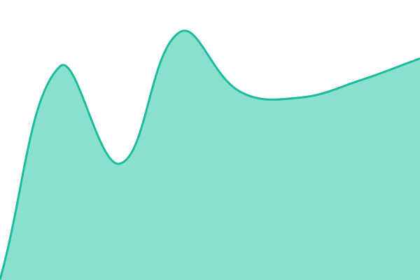
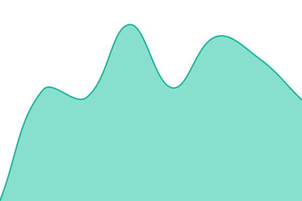

# [📈 Live Status](https://status.leadsysgen.com): <!--live status--> **🟩 All systems operational**

This repository contains the open-source uptime monitor and status page for [Abdelhakim Mhioul](http://www.mhioul.com/), powered by [Upptime](https://github.com/upptime/upptime).

With [Upptime](https://upptime.js.org), you can get your own unlimited and free uptime monitor and status page, powered entirely by a GitHub repository. We use [Issues](https://github.com/AbdelhakimMhioul/leadsysgen-status/issues) as incident reports, [Actions](https://github.com/AbdelhakimMhioul/leadsysgen-status/actions) as uptime monitors, and [Pages](https://status.leadsysgen.com) for the status page.

<!--start: status pages-->
<!-- This summary is generated by Upptime (https://github.com/upptime/upptime) -->
<!-- Do not edit this manually, your changes will be overwritten -->
<!-- prettier-ignore -->
| URL | Status | History | Response Time | Uptime |
| --- | ------ | ------- | ------------- | ------ |
|  [Portal & API](https://leadsysgen.com/health) | 🟩 Up | [portal-and-api.yml](https://github.com/AbdelhakimMhioul/leadsysgen-status/commits/HEAD/history/portal-and-api.yml) | 

 509ms
     
 | 

<a href="https://status.leadsysgen.com/history/portal-and-api">100.00%</a>
    

|  [Webhook Ingestion (Meta)](https://leadsysgen.com/api/webhooks/meta) | 🟩 Up | [webhook-ingestion-meta.yml](https://github.com/AbdelhakimMhioul/leadsysgen-status/commits/HEAD/history/webhook-ingestion-meta.yml) | 

 408ms
     
 | 

<a href="https://status.leadsysgen.com/history/webhook-ingestion-meta">100.00%</a>
    

|  [Marketing Site](https://leadsysgen.com) | 🟩 Up | [marketing-site.yml](https://github.com/AbdelhakimMhioul/leadsysgen-status/commits/HEAD/history/marketing-site.yml) | 

 859ms
     
 | 

<a href="https://status.leadsysgen.com/history/marketing-site">100.00%</a>
    

<!--end: status pages-->

[**Visit our status website →**](https://status.leadsysgen.com)

## 📄 License

- Powered by: [Upptime](https://github.com/upptime/upptime)
- Code: [MIT](./LICENSE) © [Anand Chowdhary](https://anandchowdhary.com)
- Data in the `./history` directory: [Open Database License](https://opendatacommons.org/licenses/odbl/1-0/)
